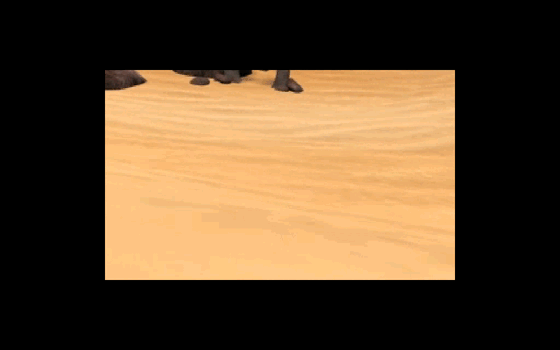
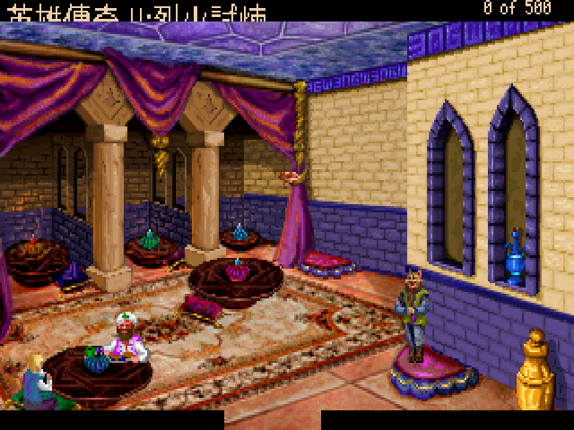
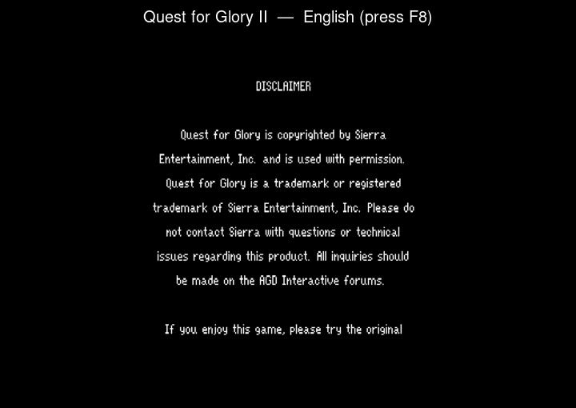
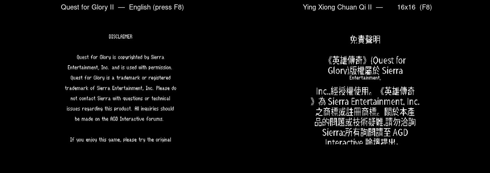

# 英雄傳奇 II:烈火試煉 — 繁體中文化
### Quest for Glory II: Trial by Fire (AGDI VGA Remake) — Traditional Chinese

> 還記得嗎？1990 年的某個午後，你在電腦店架上翻到一盒《Quest for Glory》。
> 第一代《So You Want to Be a Hero》你玩到能背出史畢柏格每一條小徑；可是第二代——那個把你帶進沙漠、帶進夏皮爾市集、帶進一場注定要燒起來的試煉——卻始終只有一個用文字輸入指令、畫面還停在 EGA 十六色的版本。
>
> 它是 Sierra 最後一款 SCI0 遊戲，也是唯一一款 Sierra 自己**從沒**做成 VGA 滑鼠點選版的英雄傳奇。三大誌的攻略翻譯陪你走過大半，但那盒卡帶始終欠你一個完整的、看得懂的版本。
>
> 2008 年，一群叫 AGD Interactive 的人花了八年，把它重製成 VGA point-and-click。十八年後的今天，這個 repo 把它補上最後一塊——**繁體中文**。
>
> 這封回信可以三種讀法：想直接玩，跳到下面的「怎麼玩」；想重溫那座沙漠之城的來龍去脈，從頭慢慢讀；只想查譯名，翻到 [`CONTEXT.md`](CONTEXT.md) 就是一份對照表。

---

## 這是什麼

把 **AGD Interactive 的《Quest for Glory II: Trial by Fire》VGA 重製版**（2008，以 Adventure Game Studio 2.72 製作）做成繁體中文，跑在 **ScummVM** 上。中文不是縮小硬塞進原本的小字位，而是給 ScummVM 的 AGS 引擎動了刀：攔截繪字、注入點陣中文、行高重算，讓方塊字端正地落在原汁原味的 VGA 畫面裡。

因為跑在 ScummVM 上，它天生跨平台——**Windows / macOS / Linux / Android** 同一套漢化。

### 目前進度（誠實版）

漢化分三件事：**引擎能畫中文**、**翻譯文本**、**全平台打包**。

| 部分 | 狀態 |
|---|---|
| 引擎 CJK 渲染（ScummVM AGS patch） | ✅ 端到端打通，開場免責聲明已是繁體中文（見下圖） |
| `.tra` 翻譯注入 + UTF-8 + 點陣字 atlas | ✅ 工具鏈完成（`tools/`） |
| 全文字靜態抽取 | ✅ 6716 字串 / 2350 乾淨可翻句（引擎內走訪資料結構） |
| 中英混排同大小同基線 | ✅ 內嵌英文也烘進字圖，與中文同高同基線 |
| 遊戲中 F8 切換語言 | ✅ 繁中 16×16 → 繁中 24×24 → 英文原版，即時循環 |
| 全文翻譯 | ✅ **2352 / 2352 句全數繁中化**（語氣參照《軟體世界》攻略；中英對照典藏見 [`translation/`](translation/)） |
| 特殊名詞顯示加註 | ✅ 自創生物/地名首次出現附原文，如 索魯斯(Saurus)、卡塔(Katta) |
| 主選單裝飾標題字 | 🚧 該處繞過翻譯系統，待另解（精靈圖/字型替換） |
| 640×480 真實高解析畫布 | ⛔ ScummVM AGS 全 native 渲染、`RenderAtScreenRes` 為 no-op，無 supersampling；真高解析需把所有美術 2× + 全座標 remap（不可行於小改動）。實務以 16/24px + F8 切換 + 視窗放大替代 |
| macOS `.dmg` GitHub Actions 打包 | ✅ CI 綠燈，自動產出 .dmg |
| Android `.apk` GitHub Actions 打包 | 🚧 引擎可編譯，卡 Oboe 連結（需 ScummVM gradle/prefab 路徑） |

一句話收束這張表：能讀的劇情都能讀了。2352 句對白全數繁中、引擎端到端吐得出方塊字、桌面三平台一鍵就玩——剩下卡住的兩格（主選單的裝飾標題字、Android 打包的 Oboe 連結）都不擋你坐進夏皮爾的市集。誠實標 🚧／⛔ 是怕你期待落空，不是這座城還沒蓋好。

### 看看成果

實機開場過場 —— 鏡頭掠過夏皮爾的漫漫黃沙，AGDI 重製版的 VGA 美術原汁原味跑在 ScummVM 上：



真正坐進遊戲裡的一刻 —— 英雄踏進夏皮爾的「卡塔之尾客棧」，紫帷幔、地毯、坐墊一如當年。畫面左上的標題「英雄傳奇 II：烈火試煉」，是引擎即時渲染的繁體中文，不是貼圖：



遊戲中按 **F8**，繁中 16×16 → 繁中 24×24 → 英文原版即時循環：



左為英文原版、右為繁體中文（內嵌英文與中文同大小同基線）：



畫面看過了，該說說畫面裡那座城，還有你會在沙裡遇見的人。

---

## 大漠、火焰，與一個還沒準備好的英雄

第一代你打的是盜匪與哥布林；第二代 Sierra 把你丟進**一千零一夜**。

故事從沙漠之城**夏皮爾（Shapeir）**開始——香料、地毯、占星師、市集裡此起彼落的叫賣，還有四隻在城裡作亂的元素精靈：火、水、風、土，一隻接一隻把城市推向毀滅。你得在計時的日子裡查清楚、湊齊驅散之法、把牠們一一封印。然後，真正的試煉才開始：你的姊妹城**拉希爾（Raseir）**已經落入巫師**阿德·阿維斯（Ad Avis）**之手，衛隊長**哈維因（Khaveen）**的彎刀在城門後等著。

這一代最狠的地方在於：**它有時限**。夏皮爾的每一天都在倒數，你不能像一代那樣慢慢練功逛地圖——你得學會取捨。老英雄傳奇迷絕對記得，第一次玩到元素一個個冒出來、城市一點點崩壞時，那種被時間追著跑的焦慮。

而它真正的浪漫，是讓你**把一代的角色匯入二代**：你在史畢柏格存下的那個英雄，帶著他的力量、法術與榮譽，繼續走進沙漠。盜賊、法師、戰士三種出身一路成長，戰士若榮譽夠高、心夠正，能在這一代首度走上**聖騎士（Paladin）**之路——這條線，是整個系列最動人的設計之一。

> **譯名考古**：夏皮爾、拉希爾這些名字當年沒有官方中譯，三大誌各譯各的，有人照英文唸、有人自己掰一個。我們不是要說誰翻錯——那年代手上根本沒有官方中譯本可對。本作走**阿拉伯/波斯風**音譯（夏皮爾、拉希爾、阿姿莎、茱拉娜爾、奧瑪爾），貼近遊戲的一千零一夜底色；QFG 自創的種族（獅人、卡塔族、索魯斯坐騎）則保留原音。完整對照見 [`CONTEXT.md`](CONTEXT.md)。

---

## 一段該被記住的歷史

知道了會在沙漠裡遇見誰，再回頭看這款遊戲本身——你會明白這份漢化為什麼非做不可。故事得從 1989 年說起。那一年，Sierra On-Line 的 Lori 與 Corey Cole 夫婦做了一件當時沒人敢做的事：他們把角色扮演的「養成」和冒險解謎的「敘事」縫在同一款遊戲裡。《Quest for Glory I：So You Want to Be a Hero》於是誕生——你不只是看故事，你還在練力量、練法術、練偷竊，而你選的職業會讓同一個謎題有完全不同的解法。戰士破門而入，盜賊撬鎖潛行，法師一道法術解決。這在當年是石破天驚的設計。

1990 年的續作《Trial by Fire》把賭注押得更大。歐風的史畢柏格換成飄著香料與沙塵的一千零一夜之城（夏皮爾沙城裡那場與時間賽跑的試煉，前面那章已經帶你走過一遍），但 Cole 夫婦真正想證明的，是上一代那套「養成縫進敘事」的設計不是一次性的把戲——它撐得起更大的舞台、更長的故事、更高的賭注。計時的壓力、跨作匯入的英雄、戰士首度能走上的聖騎士之路，每一樣都把「你的選擇會留下後果」這件事推得更遠。這是一款續作該有的野心。

但《Trial by Fire》也是一個時代的句點。它是 Sierra **最後一款用 SCI0 引擎、最後一款用文字輸入指令**的遊戲。當系列後續一部部換上 VGA 點選介面，唯獨二代被留在了 EGA 十六色與打字指令的舊時代裡——Sierra 自己**從來沒有**把它重製成 VGA。它成了系列裡那塊缺角。

這塊缺角，被一群叫 **AGD Interactive** 的粉絲補上了。他們花了**八年**，用 Adventure Game Studio 把整部二代重新打造成 VGA 點選版，2008 年免費釋出，一字一句忠於 Cole 夫婦的原意。那是一封寫給老玩家、橫跨十八年的情書。

而這個 repo，是那封情書遲到的中文回信。當年三大誌的攻略陪我們走過大半，卻始終欠這座沙漠之城一個看得懂的版本。**現在補上了。**

懷舊到此為止。接下來是怎麼把它跑起來。

---

## 怎麼玩

### 最簡單：完整包，一鍵啟動

`tools/package_release.sh` 會把 **patched ScummVM 引擎 + 原版遊戲 + 中文資產 + 啟動器** 組成一個解壓即玩的完整包（Windows 版連相依 DLL 一起放好）：

- Linux：執行 `玩英雄傳奇II-繁中.sh`
- Windows：雙擊 `玩英雄傳奇II-繁中.bat`
- macOS：執行 `玩英雄傳奇II-繁中.command`

翻譯與字型已預先寫進包裡的 `scummvm.ini`，不必手動設定，開起來就是中文。

> 完整包含原版遊戲檔（AGDI 版權），依其授權不放上本 repo，請自行用 `tools/package_release.sh` 在本機組裝（見下方「自己 build」）。

### 進階：只拿中文資產，套到自己的安裝

1. **準備遊戲檔**：取得 AGDI 的 QFG2 VGA 重製版（免費，[agdinteractive.com](http://www.agdinteractive.com)），解壓到一個資料夾。
2. **放入中文資產**：把 release 裡的 `chinese.tra`、`cjkfont16.bin`、`cjkfont24.bin` 複製進該遊戲資料夾。
3. **啟用翻譯**：用本專案的 ScummVM 加入遊戲，在該遊戲的設定加上 `translation=chinese`（或於遊戲選項選擇中文翻譯）。

### 遊戲中切換語言：F8

遊戲進行中按 **F8**，即時循環三種模式：

**繁中 16×16 → 繁中 24×24 → 英文原版 → （回到繁中 16×16）**

- 16×16：字較小，所有文字框都塞得下，適合一般遊玩。
- 24×24：字更清晰漂亮，適合慢慢讀劇情；少數很長的文字框在原生 320×200 下可能超出畫面。
- 英文原版：直接顯示遊戲原文，方便對照。

> F8 切換對「之後繪製的文字」即時生效；已經停在畫面上的文字框要等下一句才換。中文字形烘自系統 Noto Sans CJK TC，點陣 16×16／24×24，內嵌英文同樣烘進字圖以求中英同大小同基線，不需另裝字型。

---

## 技術細節：怎麼讓 1999 年的引擎吐出方塊字

QFG2 VGA 是 **Adventure Game Studio 2.72**（2006 編譯）——一個徹頭徹尾的單位元組 ANSI 引擎，原生不認識任何一個中文字。要它畫中文，動的是 ScummVM 的 AGS 引擎，全部收斂在一份自包含 patch（`patches/0001-qfg2-cht-cjk.patch`，約 250 行）：

- **`shared/font/cjk_font.{h,cpp}`**：載入 `cjkfontNN.bin` 點陣字 atlas（`CJKF` 標頭 + 每字 N×N 覆蓋率）。
- **`wfn_font_renderer.cpp`**：繪字迴圈中，codepoint 命中 atlas 就 blit 點陣中文，否則走原本的 WFN 點陣 ASCII 字——中英混排同一行。
- **`engine.cpp`**：偵測到 CJK atlas 時 `set_uformat(U_UTF8)`，讓 Allegro 的 `ugetxc()` 把 UTF-8 解成整個 codepoint，而非一個個亂碼位元組。
- **`fonts.cpp`**：CJK 啟用時把字型邏輯高度與行距抬到 ≥ 字級，多行中文不再上下重疊。
- **`global_game.cpp`**：AGDI 遊戲會向翻譯包要一個 base game 沒有的字型 slot；改成寬容處理而非 `quit()`。

翻譯本身走 AGS 原生的 `.tra` 機制（原文→譯文 dictionary，Avis Durgan 加密，UTF-8 hint 經 `ext_sopts` 宣告）。`tools/make_tra.py` 把 `tools/translation.tsv` 編成 `.tra`；`tools/build_cjk_font.py` 從系統字型烘 atlas。整條都在 docker（含 Python 的 uv venv）內，不污染系統。

### 自己 build

把原版解壓到 `game/`（`game/Qfg2vga.exe` 存在）後,一鍵 bootstrap(全程 Docker,不污染系統):

```bash
bash tools/dev-setup.sh                 # 建環境 → patch → 編引擎 → 烘字型 → 產 .tra
bash tools/package_release.sh linux     # 組完整可玩包 → out/release/qfg2-cht-linux.tar.gz
```

各步驟拆解、跨平台打包與工具鏈速查見 [`docs/DEV-SETUP.md`](docs/DEV-SETUP.md);工程過程與技術決策見 [`docs/MAKING-OF.md`](docs/MAKING-OF.md)。

macOS `.dmg`、Windows `.exe`(含相依 DLL)與 Android `.apk` 由 GitHub Actions（`.github/workflows/build.yml`）打包,不需對應平台的機器;下載 CI artifact 後用 `ENGINE=... tools/package_release.sh <平台>` 組完整包。

---

## 致謝

- **Sierra On-Line / Lori & Corey Cole** — 1990 年的原版《Quest for Glory II》與整個系列。
- **AGD Interactive** — 八年心血的 VGA 重製版。原版仍可於 [agdinteractive.com](http://www.agdinteractive.com) 免費下載，請去支持原作者。
- **ScummVM 團隊** — 讓三十年的老引擎還能在現代裝置上呼吸。
- 1990 年代《電腦玩家》《軟體世界》《PC Game》三大誌的英雄傳奇攻略與譯文，是這份譯名的起點。

## 授權

ScummVM 引擎與本專案的引擎 patch 採 **GPLv3**。遊戲資料（AGDI QFG2 VGA）版權屬原作者，**不**包含在本 repo——請自行向 AGDI 取得。中文翻譯文本以 CC BY-NC-SA 釋出。

> 三大誌當年在二代的專文裡，總要在結尾嘆一句「可惜沒中文版」。
> 現在有了。這個 repo，就是那句話遲到三十多年的回答。
