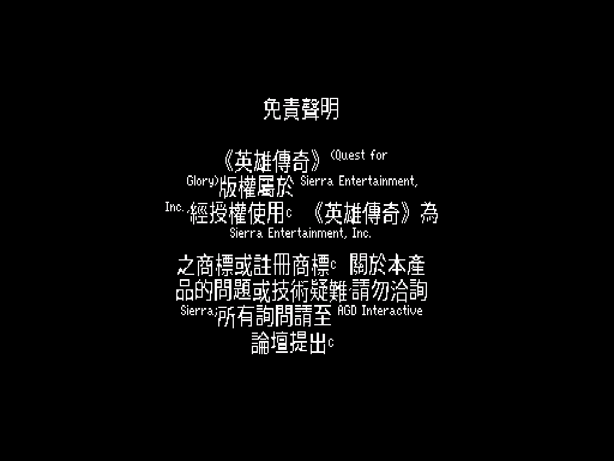

# 英雄傳奇 II:烈火試煉 — 繁體中文化
### Quest for Glory II: Trial by Fire (AGDI VGA Remake) — Traditional Chinese

> 還記得嗎？1990 年的某個午後，你在電腦店架上翻到一盒《Quest for Glory》。
> 第一代《So You Want to Be a Hero》你玩到能背出史畢柏格每一條小徑；可是第二代——那個把你帶進沙漠、帶進夏皮爾市集、帶進一場注定要燒起來的試煉——卻始終只有一個用文字輸入指令、畫面還停在 EGA 十六色的版本。
>
> 它是 Sierra 最後一款 SCI0 遊戲，也是唯一一款 Sierra 自己**從沒**做成 VGA 滑鼠點選版的英雄傳奇。三大誌的攻略翻譯陪你走過大半，但那盒卡帶始終欠你一個完整的、看得懂的版本。
>
> 2008 年，一群叫 AGD Interactive 的人花了八年，把它重製成 VGA point-and-click。十八年後的今天，這個 repo 把它補上最後一塊——**繁體中文**。

---

## 這是什麼

把 **AGD Interactive 的《Quest for Glory II: Trial by Fire》VGA 重製版**（2008，以 Adventure Game Studio 2.72 製作）做成繁體中文，跑在 **ScummVM** 上。中文不是縮小硬塞進原本的小字位，而是給 ScummVM 的 AGS 引擎動了刀：攔截繪字、注入點陣中文、行高重算，讓方塊字端正地落在原汁原味的 VGA 畫面裡。

因為跑在 ScummVM 上，它天生跨平台——**Windows / macOS / Linux / Android** 同一套漢化。

### 目前進度（誠實版）

漢化分三件事：**引擎能畫中文**、**翻譯文本**、**全平台打包**。

| 部分 | 狀態 |
|---|---|
| 引擎 CJK 渲染（ScummVM AGS patch） | ✅ 端到端打通，開場免責聲明已是繁體中文（見下圖） |
| `.tra` 翻譯注入 + UTF-8 + 點陣字 atlas | ✅ 工具鏈完成（`tools/`） |
| 全文字靜態抽取 | ✅ 6716 字串 / 2350 乾淨可翻句（引擎內走訪資料結構） |
| 全文翻譯 | 🚧 進行中（主線首批已譯，語氣待依《軟體世界》攻略回調） |
| 主選單裝飾標題字 | 🚧 該處繞過翻譯系統，待另解（精靈圖/字型替換） |
| 640×480 / 24×24 高解析畫布 | 🚧 目前 16×16 + ScummVM 視窗放大；hi-res canvas 待做 |
| macOS `.dmg` GitHub Actions 打包 | ✅ CI 綠燈，自動產出 .dmg |
| Android `.apk` GitHub Actions 打包 | 🚧 引擎可編譯，卡 Oboe 連結（需 ScummVM gradle/prefab 路徑） |



---

## 大漠、火焰，與一個還沒準備好的英雄

第一代你打的是盜匪與哥布林；第二代 Sierra 把你丟進**一千零一夜**。

故事從沙漠之城**夏皮爾（Shapeir）**開始——香料、地毯、占星師、市集裡此起彼落的叫賣，還有四隻在城裡作亂的元素精靈：火、水、風、土，一隻接一隻把城市推向毀滅。你得在計時的日子裡查清楚、湊齊驅散之法、把牠們一一封印。然後，真正的試煉才開始：你的姊妹城**拉希爾（Raseir）**已經落入巫師**阿德·阿維斯（Ad Avis）**之手，衛隊長**哈維因（Khaveen）**的彎刀在城門後等著。

這一代最狠的地方在於：**它有時限**。夏皮爾的每一天都在倒數，你不能像一代那樣慢慢練功逛地圖——你得學會取捨。老英雄傳奇迷絕對記得，第一次玩到元素一個個冒出來、城市一點點崩壞時，那種被時間追著跑的焦慮。

而它真正的浪漫，是讓你**把一代的角色匯入二代**：你在史畢柏格存下的那個英雄，帶著他的力量、法術與榮譽，繼續走進沙漠。盜賊、法師、戰士三種出身一路成長，戰士若榮譽夠高、心夠正，能在這一代首度走上**聖騎士（Paladin）**之路——這條線，是整個系列最動人的設計之一。

> **譯名考古**：夏皮爾、拉希爾這些名字當年沒有官方中譯，三大誌各譯各的。本作走**阿拉伯/波斯風**音譯（夏皮爾、拉希爾、阿濟莎、茱拉娜爾、奧瑪爾），貼近遊戲的一千零一夜底色；QFG 自創的種族（獅人、卡塔族、索魯斯坐騎）則保留原音。完整對照見 [`CONTEXT.md`](CONTEXT.md)。

---

## 怎麼玩

你需要三樣東西：**原版遊戲檔**、**patched ScummVM**、**本專案的中文資產**。

1. **準備遊戲檔**：取得 AGDI 的 QFG2 VGA 重製版（免費，[agdinteractive.com](http://www.agdinteractive.com)），解壓到一個資料夾。
2. **放入中文資產**：把 release 裡的 `chinese.tra` 與 `cjkfont16.bin` 複製進該遊戲資料夾。
3. **啟用翻譯**：用本專案的 ScummVM 加入遊戲，在該遊戲的設定加上 `translation=chinese`（或於遊戲選項選擇中文翻譯）。

> 中文字形烘自系統的 Noto Sans CJK TC，點陣 24×24／16×16，不需另裝字型。

---

## 技術細節：怎麼讓 1999 年的引擎吐出方塊字

QFG2 VGA 是 **Adventure Game Studio 2.72**（2006 編譯）——一個徹頭徹尾的單位元組 ANSI 引擎，原生不認識任何一個中文字。要它畫中文，動的是 ScummVM 的 AGS 引擎，全部收斂在一份自包含 patch（`patches/0001-qfg2-cht-cjk.patch`，約 250 行）：

- **`shared/font/cjk_font.{h,cpp}`**：載入 `cjkfontNN.bin` 點陣字 atlas（`CJKF` 標頭 + 每字 N×N 覆蓋率）。
- **`wfn_font_renderer.cpp`**：繪字迴圈中，codepoint 命中 atlas 就 blit 點陣中文，否則走原本的 WFN 點陣 ASCII 字——中英混排同一行。
- **`engine.cpp`**：偵測到 CJK atlas 時 `set_uformat(U_UTF8)`，讓 Allegro 的 `ugetxc()` 把 UTF-8 解成整個 codepoint，而非一個個亂碼位元組。
- **`fonts.cpp`**：CJK 啟用時把字型邏輯高度與行距抬到 ≥ 字級，多行中文不再上下重疊。
- **`global_game.cpp`**：AGDI 遊戲會向翻譯包要一個 base game 沒有的字型 slot；改成寬容處理而非 `quit()`。

翻譯本身走 AGS 原生的 `.tra` 機制（原文→譯文 dictionary，Avis Durgan 加密，UTF-8 hint 經 `ext_sopts` 宣告）。`tools/make_tra.py` 把 `tools/translation.tsv` 編成 `.tra`；`tools/build_cjk_font.py` 從系統字型烘 atlas。整條都在 docker（含 Python 的 uv venv）內，不污染系統。

### 從原始碼建置

```bash
# 1. 取得並 patch 上游 ScummVM（pin 在 patches/UPSTREAM_COMMIT.txt）
bash tools/apply_patches.sh

# 2. build(Linux，僅 ags engine,Docker)
docker build -t qfg2-scummvm-builder -f tools/Dockerfile.builder tools/
docker run --rm -v "$PWD/scummvm-src":/src -w /src qfg2-scummvm-builder \
  bash -c "./configure --disable-all-engines --enable-engine=ags --enable-release && make -j\$(nproc)"

# 3. 產生中文資產
bash tools/build_release_assets.sh
```

macOS `.app/.dmg` 與 Android `.apk` 由 GitHub Actions（`.github/workflows/build.yml`）打包，不需 Mac 機。

---

## 致謝

- **Sierra On-Line / Lori & Corey Cole** — 1990 年的原版《Quest for Glory II》與整個系列。
- **AGD Interactive** — 八年心血的 VGA 重製版。原版仍可於 [agdinteractive.com](http://www.agdinteractive.com) 免費下載，請去支持原作者。
- **ScummVM 團隊** — 讓三十年的老引擎還能在現代裝置上呼吸。
- 1990 年代《電腦玩家》《軟體世界》《PC Game》三大誌的英雄傳奇攻略與譯文，是這份譯名的起點。

## 授權

ScummVM 引擎與本專案的引擎 patch 採 **GPLv3**。遊戲資料（AGDI QFG2 VGA）版權屬原作者，**不**包含在本 repo——請自行向 AGDI 取得。中文翻譯文本以 CC BY-NC-SA 釋出。

> 三大誌當年在二代的專文裡，總要在結尾嘆一句「可惜沒中文版」。
> 現在有了。這個 repo，就是那句話遲到三十多年的回答。
