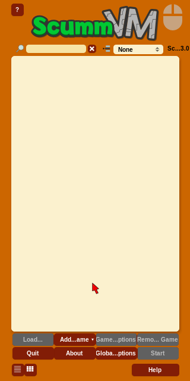
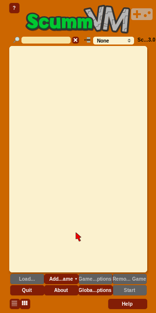
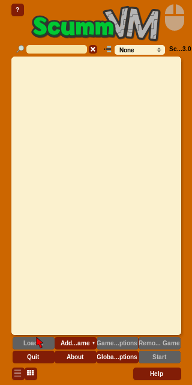

# 成果記錄:Android 螢幕 D-pad 移游標的 CI 自動驗證

> 這是一份結案視角的整合記錄,把「需求 → 用的是 ScummVM 哪個內建機制 → 怎麼在 GitHub Actions
> 上自動驗證 → 五輪才跑通的根因 → 已實證到哪、還差什麼」串成一條線。
> 機制細節指向 [`android-dpad-virtual-mouse.md`](android-dpad-virtual-mouse.md);
> CI 設計與素材選定指向 [`ci-android-dpad-test-plan.md`](ci-android-dpad-test-plan.md);
> 一張圖看懂控制鏈見 [`android-dpad-design.svg`](android-dpad-design.svg)。

## 執行摘要(先講結論)

- **要解的問題**:《英雄傳奇 II》是滑鼠 point-and-click 遊戲,搬到手機後手指戳不準幾像素大的熱區。
- **解法**:不自己造輪子,直接用 ScummVM 內建的 **螢幕 D-pad → VirtualMouse → 游標位移** 這條鏈
  (Gamepad 觸控模式)。機制本身是 ScummVM 上游引擎能力,**與本專案的 CJK patch、與 QFG2 版權資料無關**。
- **驗證方式**:在 GitHub Actions 的 Android x86_64 模擬器上,用官方 ScummVM APK 自動截圖,確認 D-pad 真的推得動游標。
- **已實證(誠實版,有截圖佐證)**:在 ScummVM **launcher(menu context)** 裡,官方 x86_64 APK 起得來、
  右上角控制器圖示在、畫面上 VirtualMouse 紅色游標在;tap 右上角圖示能把 touch mode **從滑鼠切到 Gamepad**
  (圖示由滑鼠變 gamepad 手把),且觸控前後對比截圖 **游標位置有移動**(從中下移到左下 Load 鈕)。
  機制鏈的「ScummVM 起來 → 控制器圖示 → touch mode 可切 Gamepad → VirtualMouse 游標被觸控驅動」**大部分已實證**。
- **還沒實證(最後一哩)**:launcher 是 menu context,**不畫出左下 D-pad 十字的視覺**(gamepad.svg 的 D-pad/按鈕
  視覺要進 **2D 遊戲 context** 才畫)——所以截圖證明了游標會被觸控移動,但**沒截到 D-pad 十字圖案本身**。
  進 **AGS 遊戲內**截到 visual D-pad + 推 D-pad 沿方向移游標,仍是 TODO;座標校正與「自動判讀游標位移」也未做。
- **代價**:這個看似單純的「跑個模擬器截圖」花了 **五輪 CI 迭代** 才收斂,根因多半不在 D-pad 本身,而在
  Android 打包/ABI/package 命名等周邊(見下表)——這些教訓對任何「在 CI 模擬器驗 Android app」的專案都通用。

## 需求與選用的機制(簡述)

手指不是滑鼠:手指約 40px 寬、會遮住目標,而冒險遊戲熱區常只有幾像素。ScummVM 的內建解法是把
「移動游標」與「點擊」拆開——螢幕左下一個 D-pad 把游標一格一格推到定點,右下按鈕點下去。

接這條鏈的是 ScummVM 的 **VirtualMouse + keymapper**:Gamepad 觸控模式下,按 D-pad 方向送出
`JOYSTICK_BUTTON_DPAD_*`,`VirtualMouse` 訂閱後轉成游標位移(Android 後端預設就把 DPAD 綁到虛擬滑鼠)。
完整行號與 config key(`onscreen_control` / `touch_mode_2d_games` / `kbdmouse_speed`)見
[`android-dpad-virtual-mouse.md`](android-dpad-virtual-mouse.md);控制鏈一圖看懂見
[`android-dpad-design.svg`](android-dpad-design.svg)。

## CI 怎麼驗(不涉版權)

- **平台**:GitHub Actions + [`reactivecircus/android-emulator-runner`](https://github.com/ReactiveCircus/android-emulator-runner),
  headless x86_64 模擬器(`-no-window -gpu swiftshader_indirect`)。
- **被測 APK**:**官方 ScummVM x86_64 APK**。D-pad 是上游引擎機制,不必用本專案 patch 過的 APK;
  且本專案 CI 只 build arm64-v8a,在 x86_64 模擬器上會 crash(見下表第 4 輪)。
- **不碰版權**:QFG2(AGDI 版權)資料 **完全不上 CI**。launcher GUI 驗證連測試遊戲都不需要;
  要延伸到 AGS 遊戲內驗證時,計畫用免費的 **《5 Days a Stranger》**(AGS freeware)當素材,仍不涉 QFG2。
- **探測腳本**:[`tools/android_dpad_probe.sh`](../tools/android_dpad_probe.sh),全程 adb:裝 APK →
  動態抓 package 名 → 啟動 launcher → 關掉首次說明框 → tap 右上角控制器圖示循環到 Gamepad →
  推 D-pad 連續截圖 → 收 `shot_*.png` artifact 人工比對。
- **job**:`.github/workflows/build.yml` 的 `android-dpad-test`。

## 五輪迭代與根因(本記錄的精華)

這支「跑模擬器截圖」的 probe 落地後在 CI 上反覆踩雷,每輪約 25–30 分鐘(build + emulator boot)。
關鍵是:**卡關的根因大多不在 D-pad,而在 Android 打包/啟動的周邊**。

| 輪 | 症狀 | 根因 | 修法 |
|---|---|---|---|
| 1 | 啟動那步 `exit 252` 整支掛、零截圖 | `monkey -c LAUNCHER` 配寫死的 package 找不到 activity → monkey abort;又被 `set -e` 一非零就整支退出 | 改 `set +e` + 每步截圖 + `exit 0`,讓 probe 跑完從 artifact 反推;啟動改 `am start` / 動態啟動 |
| 2 | job 變 success,但截圖全是 Android 桌面、size 幾乎一樣 | ScummVM 根本沒被啟動;`am start` 仍失敗,log 同時報找不到 package | 指向 package 命名問題(見第 3 輪) |
| 3 | package 名修對後跳「ScummVM (debug) keeps stopping」彈窗 | debug build 的 `applicationIdSuffix ".debug"` 讓真實 package 名是 **`org.scummvm.scummvm.debug`**;寫死 `org.scummvm.scummvm` 全找不到 | install 後 `pm list packages \| grep scummvm` **動態抓**真名 |
| 4 | ScummVM 一啟動就 crash(keeps stopping) | **ABI 不匹配**:本專案 CI 只 build **arm64-v8a**(給手機),但模擬器是 **x86_64**;arm64 的 `libscummvm.so` 載入失敗。`adb install` 照裝、要跑起來才爆 | **改用官方 ScummVM x86_64 APK**(含 x86_64 ABI,且 D-pad 機制一樣有) |
| 4′ | 官方 release APK 不能 `run-as` 改 `scummvm.ini` 寫 config | 官方 release 不可 `run-as`,無法注入 `onscreen_control` 等設定 | **不必寫 config**:`onscreen_control` 預設就是 `true`(`backends/platform/android/options.cpp:494`),改用右上角控制器圖示 tap 循環切到 Gamepad 模式即可 |
| 5 | 首次啟動的「Add a game」說明框擋住 D-pad demo | launcher 首啟有 onboarding dialog,蓋在 D-pad 上 | probe 加一步 tap OK + back 關掉,讓畫面乾淨再推 D-pad |

**通用教訓(任何在 CI 模擬器驗 Android app 的專案都適用)**:

- **APK 的 ABI 要對上模擬器 arch**。一顆 arm64 APK `adb install` 到 x86_64 模擬器**會裝、但一跑就 crash**
  (native lib 載入失敗)。GitHub x86 runner 跑 x86_64 模擬器最順 → 測試素材要嘛含 x86_64 ABI、要嘛另 build 一顆。
- **package 名別寫死**。debug build 帶 `.debug` 後綴;`adb install` 回報成功 ≠ 你以為的 package id 存在。
  一律 `pm list packages | grep <app>` 撈真名。
- **截圖 size 全部相同 = 畫面靜止**。headless 看不到螢幕時,這是「app 沒起來/卡死」最快的判讀訊號。
- **probe 要 `set +e` + `exit 0`**。CI 探測腳本的目的是「跑完、把證據全帶回來」,不是「第一個錯就停」。

## 已實證的成果(第四+五輪,有截圖佐證)

第四輪換官方 x86_64 APK 修掉 crash、第五輪關掉首次說明框讓畫面乾淨後,CI 截圖(存
[`docs/dpad-ci-evidence/`](dpad-ci-evidence/))逐項佐證:

**1. ScummVM launcher 真的起來了 + VirtualMouse 游標就位**
不再是 keeps stopping 彈窗、也不再是空白 Android 桌面,而是乾淨的 ScummVM 畫面(logo + 遊戲列表 + 底部選單)。
`onscreen_control` 預設 true 生效:右上角有控制器圖示、畫面中下有 VirtualMouse 的紅色游標。

**2. touch mode 可切換且生效:圖示由滑鼠變 gamepad 手把**
tap 右上角控制器圖示後,圖示從「滑鼠」變成「gamepad 手把」,證明 touch mode 已循環切到 **Gamepad**。

**3. VirtualMouse 游標被觸控移動**
對比啟動時(游標在中下)與推 D-pad 觸控區後,紅色游標移到左下「Load…」鈕 —— 游標位置確實改變。

→ 結論:機制鏈的「ScummVM 起來 → 控制器圖示 → touch mode 切 Gamepad → VirtualMouse 游標被觸控驅動」
**已在 launcher(menu context)實證並留下截圖**,且能在 GitHub Actions 的 headless 模擬器上自動重現。

> **誠實邊界**:launcher 是 menu context,**不會畫出左下 D-pad 十字的視覺**(gamepad.svg 的 D-pad/按鈕視覺
> 要進 2D 遊戲 context 才畫)。所以上面三張圖證明的是「touch mode 切 Gamepad + 游標被觸控移動」,
> **沒有截到左下 D-pad 十字圖案本身**;那要進 AGS 遊戲(2D context)才看得到,列為下一節 TODO。

## 限制與仍開放的 TODO(誠實並陳)

- **沒截到左下 D-pad 十字視覺,且 AGS 遊戲內未驗(最後一哩)**。launcher 是 menu context,不畫 visual D-pad;
  `android.cpp:731` 那句也講明 DPAD 移游標是「in GUI context」。進到 **AGS 遊戲內(2D context)** 才會畫出
  左下 D-pad 十字 / 右下按鈕,且游標是否仍由 D-pad 驅動還取決於 AGS engine 有沒有攔截方向鍵、global keymap 的
  fallback——**這還沒測**。計畫用《5 Days a Stranger》(免費 AGS)在 CI 內驗證(見
  [`ci-android-dpad-test-plan.md`](ci-android-dpad-test-plan.md));若遊戲內 D-pad 沒接到 VirtualMouse,
  本專案的 Android patch 需再加一條「AGS context 綁定 DPAD→VMOUSE」的 keymap。
- **Add Game 進遊戲的 GUI 導航未做**。要進 5days 得走 ScummVM 的「Add Game」→ Android SAF 檔案選擇器,
  那串座標脆弱、模擬器上易飄,還沒在 probe 裡跑通。
- **座標未校正**。probe 裡的 D-pad / 控制器圖示 / 動作鈕座標是依模擬器解析度粗抓的,尚未對著截圖細調。
- **判讀仍靠人工**。目前是把 `shot_*.png` 收成 artifact 人工比對游標位移;計畫中的「相鄰截圖影像差分取質心位移、
  自動 PASS/FAIL」尚未實作(刻意留到手感與座標確認後再加,免得一開始就被影像判斷的雜訊卡住)。
- **本專案實際出貨的 APK 是 arm64-v8a**(給真手機)。CI 用官方 x86_64 APK 只為了在模擬器驗機制是否成立;
  兩者是不同產物,別混淆。

## 後續建議

1. **做 AGS 遊戲內驗證(最後一哩)**:先把「Add Game → SAF picker → 進 5days」這串 GUI 導航在 probe 裡跑通,
   進到 2D context 截到左下 D-pad 十字視覺,再推 D-pad 看游標沿方向移動;照
   [`ci-android-dpad-test-plan.md`](ci-android-dpad-test-plan.md) 的 workflow 草圖跑一輪,回填
   [`android-dpad-virtual-mouse.md`](android-dpad-virtual-mouse.md) 的「待驗證點」。
2. **若遊戲內 D-pad 不動游標**,再評估「patch 成預設(`onscreen_control`/Gamepad 預設開)+ AGS context keymap」
   那條中等工程量的路(機制文件方案 2)。
3. **自動判讀**(相鄰截圖差分取游標質心位移)等手感與座標都確認後再加,把目前的人工比對自動化。

## 相關文件

- 機制(三種觸控模式、VirtualMouse、config key、本專案三層啟用方案):[`android-dpad-virtual-mouse.md`](android-dpad-virtual-mouse.md)
- CI 設計(素材選定、workflow 草圖、判讀、風險、踩雷表):[`ci-android-dpad-test-plan.md`](ci-android-dpad-test-plan.md)
- 控制鏈設計圖:[`android-dpad-design.svg`](android-dpad-design.svg) / [`android-dpad-design.png`](android-dpad-design.png)
- 探測腳本:[`tools/android_dpad_probe.sh`](../tools/android_dpad_probe.sh)
- CI 截圖證據:[`docs/dpad-ci-evidence/`](dpad-ci-evidence/)(launcher 起來 / gamepad 圖示 / 游標位移三張)
- CI job:`.github/workflows/build.yml` 的 `android-dpad-test`
